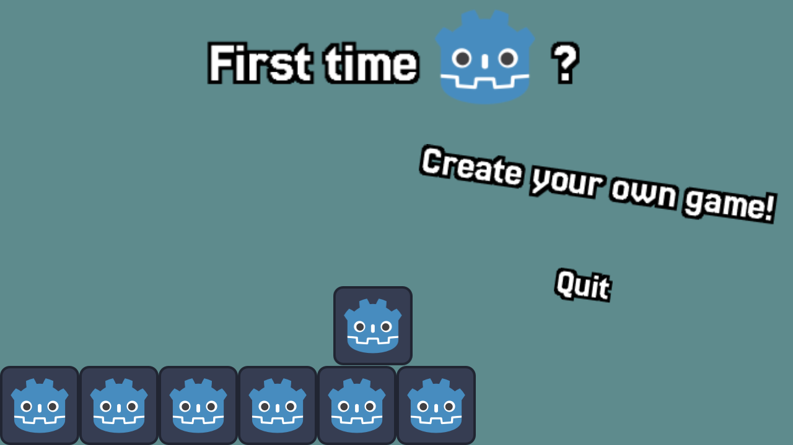
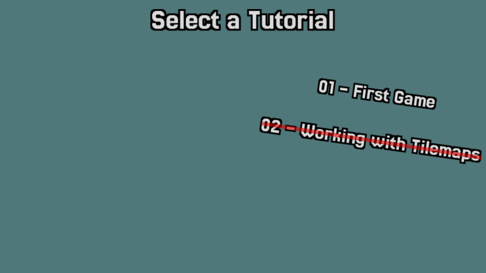
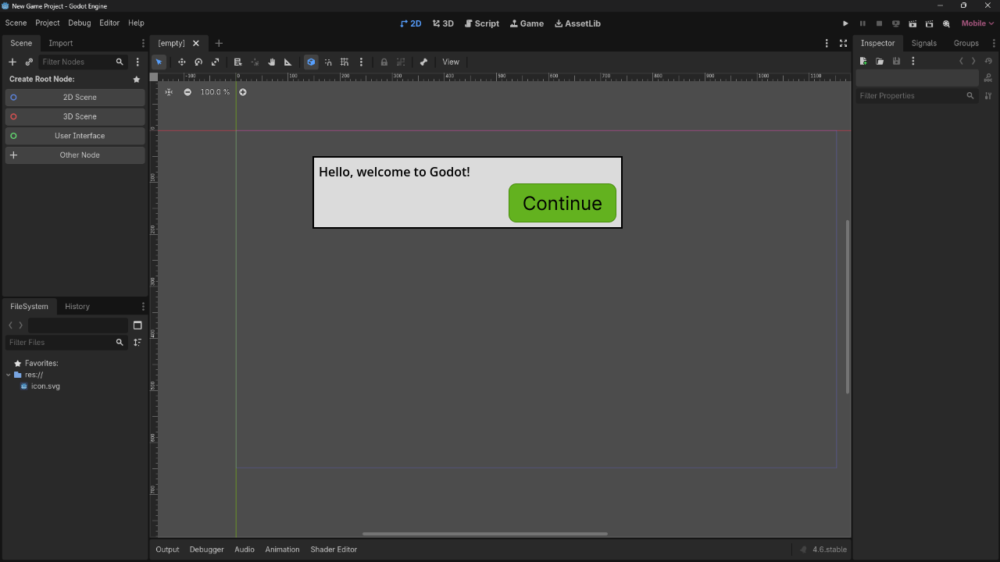
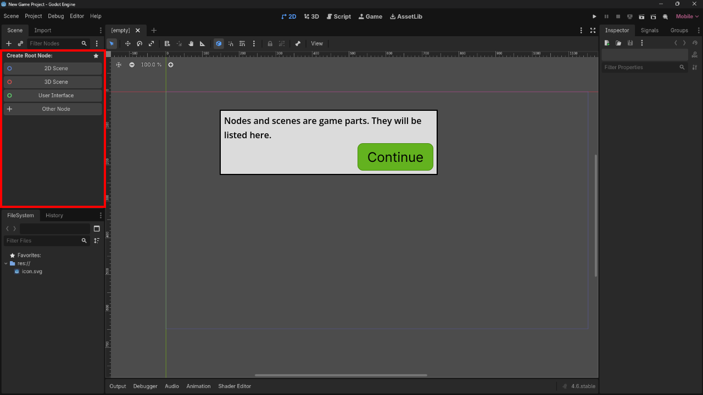
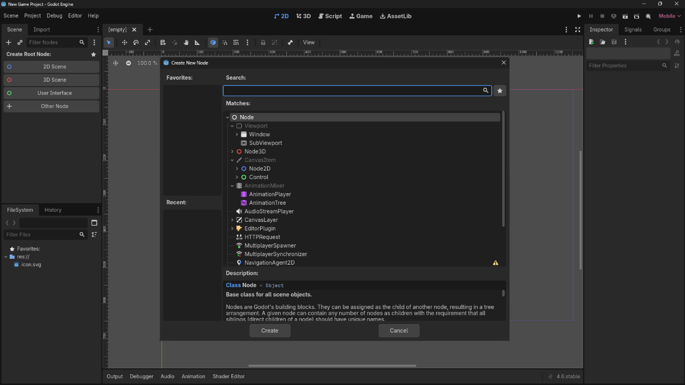
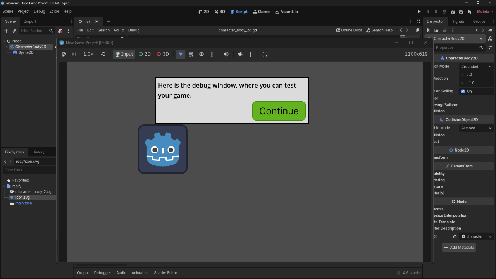

# First Time Godot?

First Time Godot is an interactive tutorial game to learn Godot

Itch.io: https://nils1024.itch.io/first-time-godot

## How to play?
1. Select "Create your own game!"
2. Select the tutorial you wish to play
3. Follow the instructions

## Screenshots

## Building
1. Open the project in Godot 4.6
2. Click Project -> Export
3. Add the Web preset
    1. Click "Manage Export Templates"
    2. Click "Download and Install"
    3. Click Close when it finished downloading
4. Click Export Project